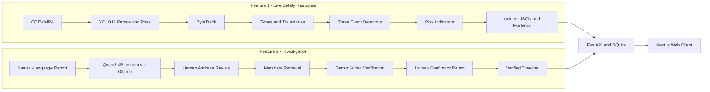

# SafeTrip

SafeTrip is a human-in-the-loop railway safety and CCTV investigation system. It combines real-time computer vision, deterministic safety rules, a local language model, and Gemini video understanding to support two complementary workflows:

1. **Live Safety Response** detects safety risks while CCTV footage is being processed.
2. **Post-Incident Investigation** turns a passenger or officer report into searchable attributes, retrieves relevant CCTV clips, and helps an investigator build a verified timeline.

The current demo is modeled around the real layout and visual identity of Tanah Abang Station in Jakarta. Generated videos are demo assets; AI recommendations are never treated as final evidence without human confirmation.

## Table of contents

- [What the project does](#what-the-project-does)
- [System architecture](#system-architecture)
- [AI components](#ai-components)
- [Repository structure](#repository-structure)
- [Requirements](#requirements)
- [Complete installation](#complete-installation)
- [Run the complete application](#run-the-complete-application)
- [Run Feature 1: Live Safety Response](#run-feature-1-live-safety-response)
- [Run Feature 2: Post-Incident Investigation](#run-feature-2-post-incident-investigation)
- [Demo videos and generated assets](#demo-videos-and-generated-assets)
- [Configuration](#configuration)
- [Testing](#testing)
- [Troubleshooting](#troubleshooting)
- [Safety and demo limitations](#safety-and-demo-limitations)

## What the project does

### Feature 1: Live Safety Response

The live safety pipeline processes CCTV video and produces explainable incident alerts.

```text
CCTV video
  -> YOLO person detection
  -> ByteTrack multi-object tracking
  -> semantic zone and movement analysis
  -> event-specific deterministic rules
  -> temporal confirmation and cooldown
  -> transparent risk indicators
  -> incident JSON, snapshot, and evidence clip
```

The MVP supports exactly three event types:

| Event | What it detects | Main signals |
| --- | --- | --- |
| `restricted_zone_intrusion` | A tracked person remains inside a configured restricted polygon | footpoint inside zone, duration, movement direction |
| `possible_person_down` | A person appears horizontal and remains nearly motionless | bounding-box ratio, normalized speed, optional pose score, duration |
| `crowd_compression` | A monitored zone becomes crowded while movement slows | person count, zone capacity, density growth, average speed, flow consistency |

An alert is not created from a single frame. Each detector uses a temporal state machine, minimum-duration threshold, and cooldown to reduce flicker and duplicate alerts. Every exported incident includes `requires_human_review: true`.

### Feature 2: Post-Incident Investigation

The investigation workflow starts from a natural-language report rather than a live detector.

```text
Natural-language report
  -> Qwen structured attribute extraction
  -> investigator correction and confirmation
  -> time, camera, location, clothing, accessory, and direction filtering
  -> deterministic candidate ranking
  -> Gemini VLM verification or cached verification
  -> investigator confirm/reject
  -> chronological human-verified timeline
```

Example report:

```text
A person wearing a grey jacket and black backpack moved toward Exit D at approximately 17:10.
```

Structured search attributes:

```json
{
  "time_window_start": "2026-07-17T17:05:00+07:00",
  "time_window_end": "2026-07-17T17:15:00+07:00",
  "location": "Lantai 1 Concourse",
  "upper_clothing": "grey jacket",
  "lower_clothing": "dark trousers",
  "accessories": ["black backpack"],
  "direction": "toward Exit D",
  "event": "running",
  "camera_ids": []
}
```

Explicit time, location, and direction values entered in the form override extracted values. The investigator must review and confirm the attributes before an investigation can start.

## System architecture



### Runtime processes

The complete local demo uses up to three processes:

| Process | Default address | Purpose |
| --- | --- | --- |
| Ollama | `http://127.0.0.1:11434` | Runs Qwen locally for report-to-JSON extraction |
| FastAPI | `http://127.0.0.1:8000` | API, database, incidents, investigations, and AI orchestration |
| Next.js | `http://localhost:3000` | Passenger and operations user interfaces |

The standalone Feature 1 video pipeline is launched as a command when required; it is not a permanent service.

## AI components

### YOLO11

Ultralytics YOLO11 detects only the `person` class. The default full-AI configuration uses:

- `yolo11n.pt` for person detection and ByteTrack input;
- `yolo11n-pose.pt` for the optional person-down pose signal;
- confidence threshold `0.15`;
- inference size `1280`;
- `device: auto` so Ultralytics uses an available accelerator and otherwise falls back to CPU.

Ultralytics downloads missing official weight files automatically on the first full-AI run. An internet connection is therefore required the first time unless the weights already exist locally.

### ByteTrack

ByteTrack is selected through Ultralytics' `bytetrack.yaml`. Persistent track IDs provide trajectories, speed estimates, zone dwell time, movement direction, and per-person temporal state.

### Semantic zones

Every camera configuration defines polygons in source-video pixel coordinates. Supported zone types include restricted areas, crowd-monitoring areas, normal circulation areas, and track areas. Zone polygons must be redrawn whenever the video resolution or camera angle changes.

### Event rules and temporal confirmation

The three safety detectors are deterministic and configured in [`configs/event_rules.json`](configs/event_rules.json). The rules are intentionally transparent: every alert can be explained with duration, count, density, speed, direction, confidence, or pose indicators rather than an opaque end-to-end classification score.

### Qwen3 4B Instruct

Feature 2 uses `qwen3:4b-instruct` through the local Ollama API. Qwen converts an Indonesian or English report into a small structured schema containing location, clothing, accessories, direction, and event. The backend merges multiple tool calls, validates the result with Pydantic, limits generation length, and then applies authoritative form-field overrides.

Qwen does not inspect video. It can run without an API key. CPU-only execution works but is slower than GPU execution.

### Gemini Flash-Lite VLM

Gemini verifies candidate MP4 clips against the corrected search attributes. Its output contains:

- supported attributes;
- contradicted attributes;
- uncertainties;
- relevant start and end seconds;
- `likely_match`, `possible_match`, or `unlikely_match`;
- a source marker: `gemini`, `cached`, or `fallback`.

The configured default is `gemini-3.1-flash-lite`. A Gemini API key is optional for the deterministic demo but required for live video verification. Only MP4 files smaller than the backend's safe inline request limit are sent.

### Human review

AI output is triage, not identity proof. The system does not perform face recognition. An investigator must correct extracted attributes and explicitly confirm candidate clips before those clips are added to the verified timeline.

## Repository structure

```text
safetrip/
├── client/                         # Next.js 16 / React 19 web client
├── configs/
│   ├── cameras/                    # Video paths, event selection, and zone polygons
│   ├── event_rules.json            # Feature 1 detector thresholds
│   ├── investigation_library.json  # Feature 2 candidate-clip metadata
│   └── runtime.json                # YOLO weights, device, stride, and output settings
├── data/
│   ├── demo-videos/                # Feature 1 and generated demo footage
│   ├── investigation-videos/       # Feature 2 clips named clip-ta-001..009.mp4
│   ├── cached-ai/                  # Optional prepared inference caches
│   └── reference-images/           # Tanah Abang map, locations, and characters
├── docs/                            # Detailed workflows and Flow generation prompts
├── scripts/                         # Feature 1 runners, validation, and evaluation
├── server/
│   ├── app/                         # FastAPI routes, services, schemas, and ORM
│   ├── data/                        # Generated SQLite database; ignored by Git
│   ├── requirements.txt             # Backend dependencies
│   ├── seed.py                      # Seeds cameras, zones, officers, and playbooks
│   └── tests/                       # Backend and Feature 2 tests
├── src/transitshield_vision/        # Feature 1 computer-vision package
├── tests/                           # Feature 1 unit and pipeline tests
├── .env.example                     # Safe environment-variable template
└── pyproject.toml                   # Vision package and Python dependencies
```

The current web client is a hackathon prototype. Some screens use static demonstration data while API-backed surfaces call the FastAPI server. The backend and AI pipelines remain the source of truth for real outputs.

## Requirements

### Required software

| Software | Required for | Notes |
| --- | --- | --- |
| Git | repository checkout | Any recent version |
| Miniconda, Miniforge, or Python | backend and vision pipeline | Python `>=3.10,<3.14`; Python 3.11 is recommended |
| Ollama | local Qwen extraction | Required for live report extraction with the default `.env` |
| Bun | web client | The repository contains `client/bun.lock` |
| Internet connection | initial installation | Required for Python/JS packages, Qwen download, and first YOLO-weight download |

### Optional software

| Software | Purpose |
| --- | --- |
| NVIDIA/AMD/Apple GPU support | Faster YOLO and Ollama inference |
| FFmpeg and `ffprobe` | Inspecting, transcoding, or debugging generated videos |
| Gemini API key | Live Feature 2 video verification |
| `curl` | Health checks and API demo commands |

No dedicated GPU is required for setup or cached demos. Full video inference and Qwen work on CPU but can be significantly slower.

## Complete installation

All commands below are run from a terminal. Windows users should use Miniconda Prompt or PowerShell and translate shell-specific activation commands when necessary.

### 1. Clone the repository

```bash
git clone https://github.com/ShibainuID/safetrip.git
cd safetrip
```

### 2. Install Conda and create the Python environment

Install [Miniconda](https://docs.conda.io/miniconda.html) or another supported Conda distribution if `conda --version` does not work.

Create the environment used by this project:

```bash
conda create -n bdc2026-dinov3 python=3.11 -y
conda activate bdc2026-dinov3
python --version
```

The expected Python version is 3.11.x.

Install the vision package, development tools, and backend dependencies:

```bash
python -m pip install --upgrade pip
python -m pip install -e ".[dev]"
python -m pip install -r server/requirements.txt
```

The first command installs the local `transitshield_vision` package in editable mode. The server requirements add FastAPI, SQLAlchemy, Pydantic, HTTPX, the Google GenAI SDK, dotenv support, and multipart handling.

Verify the Python installation:

```bash
python -c "import cv2, fastapi, ultralytics; print('Python dependencies OK')"
```

### 3. Install Ollama and download Qwen

Use the official [Ollama download page](https://ollama.com/download). On Linux, the official installer command is:

```bash
curl -fsSL https://ollama.com/install.sh | sh
```

On macOS or Windows, install the Ollama application from the official download page. Then verify the installation:

```bash
ollama --version
```

Start the Ollama service if the desktop application or system service did not start it automatically:

```bash
ollama serve
```

Keep that terminal open. In a second terminal, download the exact model used by SafeTrip:

```bash
ollama pull qwen3:4b-instruct
ollama list
```

The official Q4 model download is approximately 2.5 GB. Test it directly:

```bash
ollama run qwen3:4b-instruct "Return only the JSON object: {\"status\": \"ok\"}"
```

Press `Ctrl+D` or type `/bye` if Ollama enters an interactive session.

### 4. Configure environment variables

Create the local environment file:

```bash
cp .env.example .env
```

Default development configuration:

```dotenv
REPORT_LLM_PROVIDER=ollama
OLLAMA_BASE_URL=http://127.0.0.1:11434
OLLAMA_REPORT_MODEL=qwen3:4b-instruct

GEMINI_API_KEY=
GEMINI_MODEL=gemini-3.1-flash-lite
```

The root `.env` file is loaded automatically by the backend and is ignored by Git. Never commit a real API key.

To enable live Gemini video verification, create a key in [Google AI Studio](https://ai.google.dev/gemini-api/docs/api-key), then set:

```dotenv
GEMINI_API_KEY=your_key_here
```

`GOOGLE_API_KEY` is also accepted and takes precedence when both variables are set. Gemini is optional: when credentials, media, or a valid response are unavailable, the controlled demo uses its cached VLM result. Unrelated reports without a valid AI result receive an explicit `fallback` source rather than fabricated evidence.

To use Gemini for report extraction instead of local Qwen:

```dotenv
REPORT_LLM_PROVIDER=gemini
```

### 5. Initialize the SQLite database

From the repository root:

```bash
python server/seed.py
```

This creates `server/data/transitshield.db` and seeds demo cameras, semantic zones, officers, and response playbooks.

There is no migration framework in the hackathon backend. After an ORM schema change, rebuild the local database:

```bash
rm -f server/data/transitshield.db
python server/seed.py
```

Do not run the removal command against a database containing data you need to preserve.

### 6. Install the web-client dependencies

Install [Bun](https://bun.sh/docs/installation) if `bun --version` does not work. On Linux or macOS:

```bash
curl -fsSL https://bun.com/install | bash
```

Open a new terminal if Bun was added to your `PATH`, then install the locked frontend dependencies:

```bash
cd client
bun install
cd ..
```

## Run the complete application

Use three terminals. All commands assume the repository root unless the command explicitly changes directory.

### Terminal 1: Ollama

Skip this command if the Ollama desktop application or system service is already running.

```bash
ollama serve
```

Verify it from another terminal:

```bash
curl http://127.0.0.1:11434/api/tags
```

### Terminal 2: FastAPI

```bash
conda activate bdc2026-dinov3
uvicorn server.app.main:app --reload
```

Verify the API:

```bash
curl http://127.0.0.1:8000/api/v1/health
```

Expected response:

```json
{
  "status": "healthy",
  "version": "0.1.0",
  "services": {
    "api": "ok",
    "database": "ok",
    "vision": "ok"
  }
}
```

Interactive API documentation is available at <http://127.0.0.1:8000/docs>.

### Terminal 3: Next.js

```bash
cd client
bun run dev
```

Open <http://localhost:3000>.

The client currently expects the API at `http://127.0.0.1:8000/api/v1`. If the backend uses a different host or port, update `client/src/lib/api.ts`.

## Run Feature 1: Live Safety Response

### Before running a camera

Open the selected file under `configs/cameras/` and verify:

1. `video_path` points to an existing MP4;
2. `enabled_events` contains only the event or events intended for that camera;
3. every polygon matches the actual video width, height, and camera angle;
4. crowd-monitoring zones have a realistic `capacity`;
5. the event thresholds in `configs/event_rules.json` were calibrated for that scene.

Validate the repository configuration:

```bash
python scripts/validate_config.py --allow-missing-video
```

Remove `--allow-missing-video` once the camera's configured MP4 has been copied into place.

### Full AI mode

Full AI reads the MP4, runs YOLO/ByteTrack, optionally runs YOLO pose, evaluates event rules, generates evidence, writes an annotated video, and saves a reusable JSONL track cache.

```bash
python scripts/run_demo_pipeline.py \
  --execution-mode full_ai \
  --camera-config configs/cameras/demo_camera.json \
  --output-root outputs/demo
```

The first run may download `yolo11n.pt` and `yolo11n-pose.pt`. To force CPU execution, set `"device": "cpu"` in `configs/runtime.json`. For a CUDA GPU, use a device supported by the installed PyTorch/Ultralytics build.

Typical outputs:

```text
outputs/demo/
├── annotated-videos/<video>_annotated.mp4
├── frame-events/<video>_tracks.jsonl
├── incidents/<incident-id>/...
├── incidents.json
└── pipeline_summary.json
```

### Cached AI mode

Cached AI reruns deterministic zone, temporal, and event logic from a real track cache previously generated by `full_ai`. It does not rerun YOLO.

```bash
python scripts/run_demo_pipeline.py \
  --execution-mode cached_ai \
  --camera-config configs/cameras/demo_camera.json \
  --cache-path outputs/demo/frame-events/platform_b_demo_tracks.jsonl \
  --output-root outputs/demo-cached
```

Adjust the cache filename to the stem of the video configured for that camera.

### Manual demo mode

Manual mode loads prepared incident JSON and is useful only for rehearsing downstream operations. Every non-null evidence path inside the JSON must already exist.

```bash
python scripts/run_demo_pipeline.py \
  --execution-mode manual_demo \
  --camera-config configs/cameras/demo_camera.json \
  --manual-path data/manual-demo/incidents.json \
  --output-root outputs/demo-manual
```

### Run several cameras

```bash
python scripts/run_demo_library.py \
  --camera-config configs/cameras/demo_camera.json \
  --camera-config configs/cameras/man_falls_platform.json \
  --camera-config configs/cameras/crowd_compression_concourse.json \
  --output-root outputs/library
```

Each camera writes to its own output directory. The library runner combines incidents into `outputs/library/incidents.json` without overwriting earlier cameras.

### Generate all Feature 1 monitoring videos

The Feature 1 batch command processes all six prepared camera clips with the
same full-AI YOLO, ByteTrack, event-rule, evidence, and annotation pipeline used
by the single-camera runner:

```bash
conda activate bdc2026-dinov3
python scripts/run_feature1_demo.py
```

Canonical pipeline artifacts are written to `outputs/feature-1/cameras/`. After
all six cameras finish successfully, annotated MP4 files and a browser manifest
are published to `client/public/videos/feature-1-processed/`. The Live Monitoring
page reads that manifest and labels the feeds as prerecorded pipeline output.

## Run Feature 2: Post-Incident Investigation

Feature 2 runs through FastAPI. The complete API contract and a copy-pasteable curl workflow are documented in [`docs/post-incident-investigation.md`](docs/post-incident-investigation.md).

### Controlled cached demo

The cached path requires no Gemini key and can work without local investigation videos:

1. Start FastAPI.
2. Create the controlled report.
3. Extract attributes with Qwen or use the prepared cached extraction if Qwen is unavailable.
4. Correct and confirm the attributes.
5. Start an investigation.
6. Review the ranked candidate clips.
7. Confirm or reject each candidate.
8. Read the verified timeline.

Create a report:

```bash
curl -sS http://127.0.0.1:8000/api/v1/reports \
  -H 'content-type: application/json' \
  -d '{
    "reporter_type": "passenger",
    "time_window_start": "2026-07-17T17:09:00+07:00",
    "time_window_end": "2026-07-17T17:11:59+07:00",
    "location": "",
    "description": "Orang berjaket abu-abu dan membawa tas hitam berlari menuju Exit D.",
    "direction": "toward Exit D"
  }'
```

Copy the returned `report_id`, then extract attributes:

```bash
curl -sS -X POST \
  http://127.0.0.1:8000/api/v1/reports/REPORT_ID/extract
```

The response records `extraction_source` as `ollama`, `gemini`, `cached`, or `fallback`.

Confirm corrected attributes before creating an investigation:

```bash
curl -sS -X PATCH \
  http://127.0.0.1:8000/api/v1/reports/REPORT_ID/attributes \
  -H 'content-type: application/json' \
  -d '{"attributes": {
    "time_window_start": "2026-07-17T17:09:00+07:00",
    "time_window_end": "2026-07-17T17:11:59+07:00",
    "location": "",
    "camera_ids": [],
    "upper_clothing": "grey jacket",
    "lower_clothing": "dark trousers",
    "accessories": ["black backpack"],
    "direction": "toward Exit D",
    "event": "running"
  }}'
```

Create the investigation and list candidates:

```bash
curl -sS http://127.0.0.1:8000/api/v1/investigations \
  -H 'content-type: application/json' \
  -d '{"report_id": "REPORT_ID"}'

curl -sS \
  http://127.0.0.1:8000/api/v1/investigations/INVESTIGATION_ID/candidates
```

Confirm a candidate and request the verified timeline:

```bash
curl -sS -X PATCH \
  http://127.0.0.1:8000/api/v1/investigations/INVESTIGATION_ID/candidates/CANDIDATE_ID \
  -H 'content-type: application/json' \
  -d '{"verification_status": "confirmed", "note": "Seen moving toward Exit D"}'

curl -sS \
  http://127.0.0.1:8000/api/v1/investigations/INVESTIGATION_ID/timeline
```

Reset only Feature 2 demo records while preserving camera, zone, officer, playbook, and live-incident configuration:

```bash
curl -sS -X POST http://127.0.0.1:8000/api/v1/demo/reset
```

### Live Gemini video verification

For the current nine-clip library, place MP4 files at:

```text
data/investigation-videos/clip-ta-001.mp4
data/investigation-videos/clip-ta-002.mp4
...
data/investigation-videos/clip-ta-009.mp4
```

The filenames and metadata must match [`configs/investigation_library.json`](configs/investigation_library.json). If you use descriptive filenames instead, edit each `path` in that JSON. Keep each clip under the inline Gemini request limit defined in `server/app/services/investigation_ai.py`.

Set `GEMINI_API_KEY` in `.env`, restart FastAPI, and repeat the investigation flow. Candidate responses will report `vlm_result.source: "gemini"` when live verification succeeds.

## Demo videos and generated assets

### Feature 1 footage

Generated live-safety videos belong under:

```text
data/demo-videos/feature-1/
```

The camera configuration does not discover videos automatically. Point `video_path` to the chosen file and redraw all zone polygons for that exact camera view.

### Feature 2 footage

Generated investigation videos may be kept under:

```text
data/demo-videos/feature-2/
```

To use them with the current retrieval library, either copy/rename them to `data/investigation-videos/clip-ta-001.mp4` through `clip-ta-009.mp4`, or update the library paths directly.

### Reference images and prompts

- Tanah Abang map and location references: `data/reference-images/`
- Feature 1 Flow prompts: [`docs/tanah-abang-flow-prompts.md`](docs/tanah-abang-flow-prompts.md)
- Feature 2 Flow prompts may be kept locally at `docs/tanah-abang-feature2-flow-prompts.md` while the generated investigation assets are being prepared.

Generated footage is not ground-truth evidence and must not be presented as real CCTV. It is used only to demonstrate system behavior.

## Configuration

### `configs/runtime.json`

Controls the execution mode, device, frame stride, frame limit, confidence threshold, image size, model weights, annotated-video output, and deterministic seed.

### `configs/event_rules.json`

Controls minimum event duration, cooldown, person-down geometry and pose thresholds, crowd-density thresholds, movement windows, and direction alignment.

### `configs/cameras/*.json`

Each camera defines:

- stable camera ID and name;
- MP4 path and optional FPS override;
- enabled event types;
- semantic-zone IDs, types, polygons, capacities, risk multipliers, and danger direction.

Coordinates are measured in source-video pixels. A polygon copied from another camera angle is invalid even if the resolution is identical.

### `configs/investigation_library.json`

Defines Feature 2 clip IDs, cameras, locations, timestamps, paths, retrieval metadata, and cached VLM explanations. The controlled library contains three intended target appearances and hard distractors that disagree on clothing, backpack color, or direction.

## Testing

Activate the Python environment first:

```bash
conda activate bdc2026-dinov3
```

Run Feature 1 tests:

```bash
python -m pytest tests -q
```

Run backend and Feature 2 tests:

```bash
python -m pytest server/tests -q
```

Run all Python tests:

```bash
python -m pytest tests server/tests -q
```

Run frontend lint and production build:

```bash
cd client
bun run lint
bun run build
```

Backend tests isolate external providers and do not require an Ollama service or Gemini API key.

## Troubleshooting

### `conda: command not found`

Install Miniconda/Miniforge, reopen the terminal, and initialize your shell if requested by the installer. Verify with `conda --version`.

### `ModuleNotFoundError: transitshield_vision`

Run this from the repository root inside the active Conda environment:

```bash
python -m pip install -e ".[dev]"
```

### Ollama connection refused on port 11434

Start Ollama:

```bash
ollama serve
```

Then verify the model exists:

```bash
ollama list
curl http://127.0.0.1:11434/api/tags
```

If the backend returns `cached` or `fallback`, confirm that `.env` contains `REPORT_LLM_PROVIDER=ollama` and that `qwen3:4b-instruct` is listed.

### Qwen is slow

The 4B model may run on CPU when no supported GPU is available. The first request also loads the model into memory. Keep Ollama running between requests. Do not replace the model name unless `.env` is updated to match the installed tag.

### Gemini returns cached or fallback output

Check that:

1. `.env` contains a valid `GEMINI_API_KEY` or `GOOGLE_API_KEY`;
2. the MP4 exists at the path in `configs/investigation_library.json`;
3. the file is below the inline size limit;
4. the configured Gemini model is available to the key and project;
5. quota and billing restrictions permit the request.

Cached output is intentional for the controlled offline demo and is always labeled.

### YOLO weights are not found or cannot download

Connect to the internet and rerun full AI. Ultralytics normally downloads the configured weights automatically. For offline use, obtain compatible weights in advance and update `detector_weights` and `pose_weights` in `configs/runtime.json`.

### CUDA or GPU is not used

Check the relevant runtime separately:

```bash
nvidia-smi
ollama ps
python -c "import torch; print(torch.cuda.is_available())"
```

Ollama and Ultralytics may use different GPU runtimes. A GPU visible to one process is not proof that the other process can use it. Set `device: cpu` for a slower but predictable Feature 1 fallback.

### Camera polygons are outside the frame

Read the actual video resolution with `ffprobe` or OpenCV, then redraw every polygon. Do not scale old polygons blindly when the perspective or crop changed.

### FastAPI cannot bind port 8000

Another process is probably using the port. Find and stop it, or run:

```bash
uvicorn server.app.main:app --reload --port 8001
```

If the port changes, update `client/src/lib/api.ts` before running the web client.

### Frontend cannot reach the backend

Verify:

```bash
curl http://127.0.0.1:8000/api/v1/health
```

The backend CORS configuration allows the development frontend at `localhost:3000` and `127.0.0.1:3000`.

### Database schema errors

The hackathon backend has no migration tool. Rebuild the local SQLite database only if its contents may be discarded:

```bash
rm -f server/data/transitshield.db
python server/seed.py
```

## Safety and demo limitations

- Every live-safety incident requires human review.
- A VLM recommendation is not evidence until an investigator confirms the clip.
- The system does not identify people and must not be described as face recognition.
- Generated Tanah Abang footage is synthetic demonstration material.
- Zone polygons and thresholds are camera-specific and require calibration before real deployment.
- Cached outputs are labeled and must not be represented as live model inference.
- The frontend contains prototype/demo screens; not every visual element is connected to live backend state.
- The current SQLite database and local-file media storage are appropriate for a hackathon demo, not production scale.
- Before real deployment, add authentication, authorization, encrypted storage, retention rules, audit policy, monitoring, migrations, privacy review, and operational validation using authorized CCTV data.

## Additional documentation

- [Post-Incident Investigation API and workflow](docs/post-incident-investigation.md)
- [Tanah Abang Feature 1 Flow prompts](docs/tanah-abang-flow-prompts.md)
